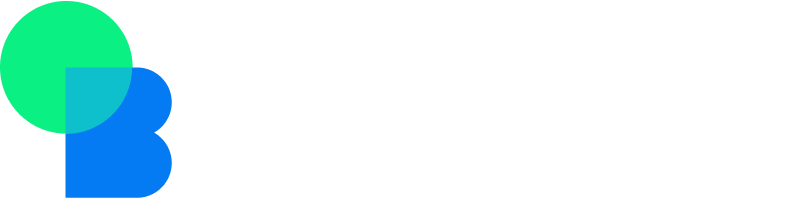

# Ganadores Mini Hackathon
En OpenBootcamp organizamos una dinámica para nuestra comunidad. ❤️

Consistía en una mini hackathon de temática libre, para que los alumnos demuestren sus habilidades.

Estos fueron los finalistas: 👇

## Sari IA ¡GANADOR! 🎉

#### 1. Este proyectazo trata de un asistente virtual por voz, desarrollado en Python 🐍. Merecido ganador, por lo innovador que fue el proyecto, y también por las funcionalidades que ofreció.
- Sari IA Virtual assistant [Repositorio](https://github.com/RubenPalomo/Virtual-Assistant)

## Linkys
#### 2. Linkys En esta web tendréis los mejores recursos para programadores, en un solo lugar!
- Linkys [Repositorio](https://github.com/brunosanz/linkys)

## My CV generator
#### 3. En esta asombrosa web-app podréis construir vuestro CV desde 0  y exportarlo como PDF directamente!
- My CV generator [Repositorio](https://github.com/Huichoman/my-cv)

## Interview Questions JavaScript
#### 4. Esta es una web muy útil para que practiques las típicas preguntas de entrevista, usando el lenguaje JavaScript.
- Interview JavaScript [Repositorio](https://github.com/kamilodev/javascript-trainer)

## Twilio Chat 
#### 5. Este es un excelente chat a tiempo real, desarrollado con Twilio, Angular y Supabase.
- Twilio Chat  [Repositorio](https://github.com/diegobarroso/twilio-chat)

## PrograMATE 
#### 5. PrograMate se trata de un asistente de chat, que te brinda recursos para aprender lo que le pidas! 🤩
- PrograMATE  [Repositorio](https://github.com/LeoCipollone/programate)

